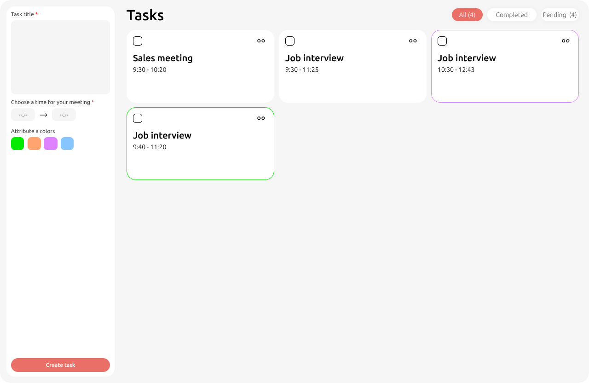

# TODO App Test Project (React + TypeScript)

Welcome to the TODO App test project! 
<!-- This project is a simple TODO list application built using React and TypeScript. -->
This template provides a minimal setup to get React and TypeScript.

### Expected result

**Figma link** : https://www.figma.com/proto/H6wQ883YuLrY50MbIz1zSu/models-recrutment?page-id=0%3A1&type=design&node-id=6-297&viewport=667%2C-122%2C0.15&t=3Or1ihfxnp3y8K0R-1&scaling=scale-down&mode=design

**Colors** 
| Color 1 | Color 2 | Color 3 | Color 4 | Background |
|-----------|:-----------:|-----------:|-----------:|-----------:|  
| 05EB00 | FFA471 | DE82FF | 8755FF | F6F6F6| 

**Icons**

<table style='background-color: white; color: black; border-radius: 15px;'>
<thead>
  <tr>
    <th> edit.svg </th>
    <th> arrow-right.svg </th>
    <th> delete.svg </th>
    <th> menu.svg</th>
  </tr>
  </thead>
  <tbody align='center'>
   <tr>
    <td>  </td>
    <td>  </td>
    <td>  </td>
    <td>  </td>
  </tr>
 </tbody>
</table>

## Tasks

1- Clone the repository

2- Create a new branch with your name

3- Create task and display in main like on UI

4- Update, edit and delete task

5- Display in main dynamic all task create, task selected, and no selected (pending)

6- When finished make a pull request.

## Technology

Reactjs

Css3 to style React components

Javascript

Typescript (recommended)

Tabler icons https://tabler-icons.io/?utm_source=figma-plugin  (optional)

## Development

Create folder Components to add all reusable components (button, card, ...)

Create layout folder for all template that you can use on your entire projects
  
 
 

## Happy coding 😉